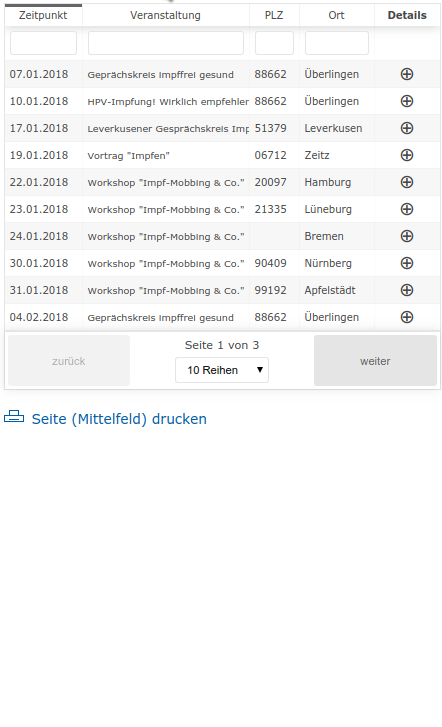

xst-google-calendar-events
===

__fetch Google Calendar Entries via API into an sortable Event-List-Table at your Website__

It's based on **[React](https://reactjs.org/)**, fetch the Data via AJAX and output an sortable Event-List Table.
No Webserver with PHP or Database needed, because it's plain HTML, JS and CSS.

## Table of content
- [DEMO](#demo)
- [Browser Support](#browser-support)
- [Requirements](#requirements)
- [Installation](#installation)
- [License](#license)
- [ToDo](#todo)
- [Links](#links)

## Demo

[Live-Demo on a Website](http://codebase.xstable.com/xst_google_events/example/)

## Browser Support

Fully compatiple to following Browsers

  - IE >= 10 1
  - firefox 
  - Chrome
  - Chrome for Android
  - UC Browser for Android
  - Samsung Internet
  - IOS - Safari

1 To support IE lower then IEedege, add https://cdn.polyfill.io/v2/polyfill.min.js into your HTML-Sourcecode.

## Requirements
- yarn or npm installed and working
- Calendar-ID of your Google Calendar. You'll find it in your Calendar-Settings: [How to get the Calender-ID](./xst_googleCalendar_getCalendar_id.mp4)
- API_KEY - to access your Google-Calendar. Get it on https://console.developers.google.com : [How to create a Google-Calendar Api-Key](./How to create a Google Api Key.pdf)

## Installation
* Download the sources to your PC
* Rename or copy `/sources/config.EXAMPLE.js` to `sources/config.js` and edit for your needs
* Run `yarn install ` on the root-path of the xst_googleEvents Directory
* Change API_KEY and CAL_ID (Calender-ID) in _/source/app.js_ to your personal credentials, you've got from your Google-Calendar
* Run `webpack -p`. This will create the file _xst_googlecalendar.js__
* Copy the file _xst_googlecalendar.xst_ to your Server and include it into your Webpage-Source-Code

## License
  - React, React-Dom, React-Table, Superagent  =  [MIT](https://spdx.org/licenses/MIT.html) 

## ToDo
  - Optimize index.html to show a nicer preview of functionality
  - implement kind of auto- detector/loader to load polyfill.io for IE 10 & 11
  - use Language-Files for Labels (Table, Buttons etc.)  
  
## Links

[Live-Demo on a Website](http://codebase.xstable.com/xst_google_events/example/)
